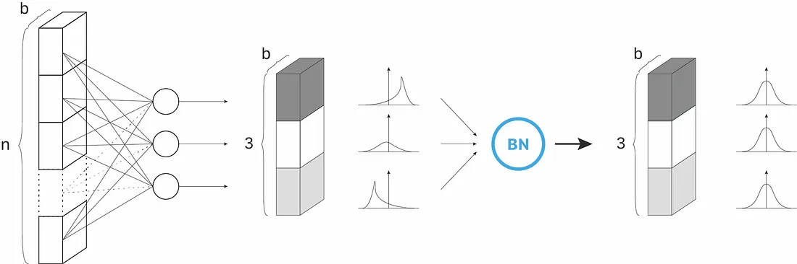

# Pretty neuaral network

## 001 Btach-normalization

Batch-Normalization (BN) is an algorithmic method which makes the training of Deep Neural Networks (DNN) faster and more stable.

It consists of normalizing activation vectors from hidden layers using the first and the second statistical moments (mean and variance) of the current batch. This normalization step is applied right before (or right after) the nonlinear function.



Основная идея данного слоя в том, что он делает делает ландшафт функции потерь, из  узких аврагов и ложбин в "равномерное круглое углубление", поэтому алгоритмы оптимизации SGD или Adam не мечеться из стороны в сторону, а спускается комфортно в наименьшую точку! 


- **x** - входные значения 
- **μ** - мат ожидание (среднее - mean)  
- **σ** - дисперсия
- **x_normal** - нормализовынные значения
- **N** - количество экземпляров в батче  

$$μ=\frac{1}{N}*\sum_{s=1}^{s} x_{s}$$  

$$σ = \sqrt{\frac{1}{1-N}  \sum_{s=1}^{S} (x_{s}-μ)^{2}}$$

$$x_{norml} =  \frac{x-μ}{σ}$$  
ВАЖНЫЙ ПОИНТ!  
При тренировке необходимо использовать несмещенную дисперсию по входу
```python
std_x_bias=((std_x*n)/(n-1)).clone() # НЕсмещеная дисперсия
```


- Сама реализация слоя  
[BatchNorm1d.py](src/layers/BatchNorm1d.py)
- Пример использования, сравнение   
[batch_norm1d_exampel.py](exampels/layers/batch_norm1d_exampel.py)  

## My code implementation BatchNorm1d
```python
import torch
from src.layers.BatchNorm1d import CustomBatchNorm1d

weight_data=torch.tensor([ 0.2961,  1.2503, -0.1758])
bias_data=torch.tensor([0.6596, 1.6274, 0.9150])
input_size = 3
batch_size = 5
eps = 1e-1
momentum = 0.5

my_batch_norm1d = CustomBatchNorm1d(weight_data,
                                    bias_data, 
                                    eps, 
                                    momentum)

torch_input = torch.randn(batch_size, input_size, dtype=torch.float)
torch_input
# TRAIN MODE
torch_output=my_batch_norm1d(torch_input)
# EVAL MODE
my_batch_norm1d.eval()
torch_output=my_batch_norm1d(torch_input)
```
