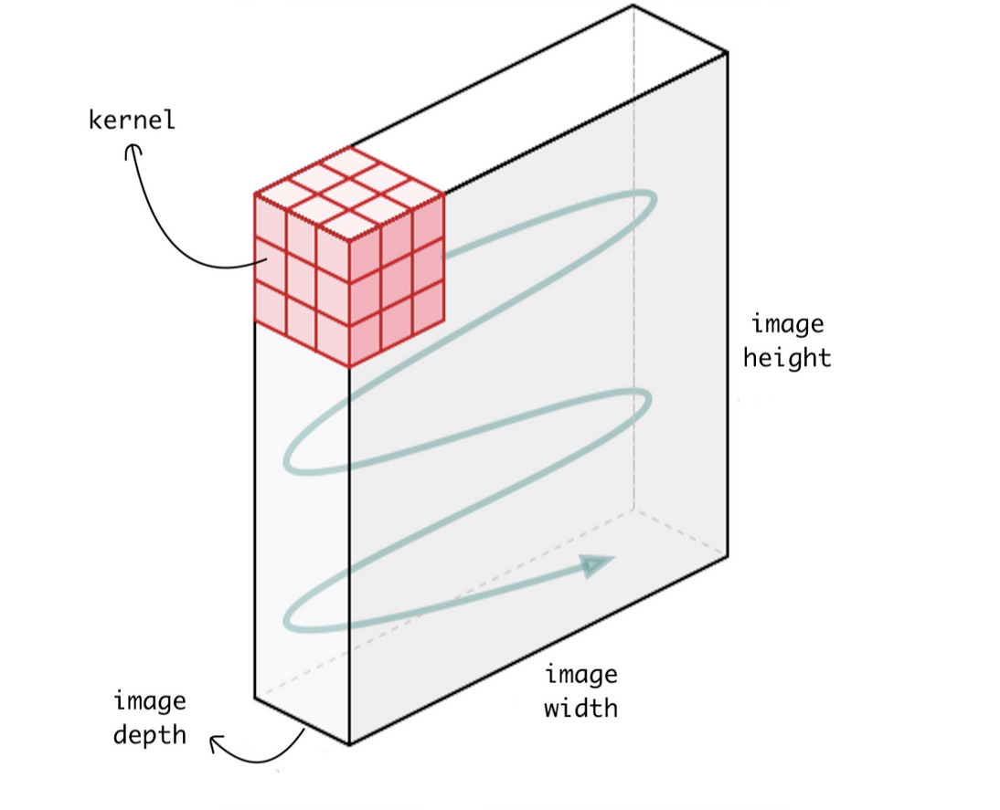

# Pretty neuaral network

## 1 Btach-normalization layer
[01 Btach-normalization layer](#01-btach-normalization-layer)  
[02 Convolutional 2d Layer](#02-convolutional-layer)


## 01 Btach-normalization layer
Batch-Normalization (BN) is an algorithmic method which makes the training of Deep Neural Networks (DNN) faster and more stable.

It consists of normalizing activation vectors from hidden layers using the first and the second statistical moments (mean and variance) of the current batch. This normalization step is applied right before (or right after) the nonlinear function.


Основная идея данного слоя в том, что он делает делает ландшафт функции потерь, из  узких аврагов и ложбин в "равномерное круглое углубление", поэтому алгоритмы оптимизации SGD или Adam не мечеться из стороны в сторону, а спускается комфортно в наименьшую точку! 


- **x** - входные значения 
- **μ** - мат ожидание (среднее - mean)  
- **σ** - дисперсия
- **x_normal** - нормализовынные значения
- **N** - количество экземпляров в батче  

$$μ=\frac{1}{N}*\sum_{s=1}^{s} x_{s}$$  

$$σ = \sqrt{\frac{1}{1-N}  \sum_{s=1}^{S} (x_{s}-μ)^{2}}$$

$$x_{norml} =  \frac{x-μ}{σ}$$  
ВАЖНЫЙ ПОИНТ!  
При тренировке необходимо использовать несмещенную дисперсию по входу
```python
std_x_bias=((std_x*n)/(n-1)).clone() # НЕсмещеная дисперсия
```


- Сама реализация слоя  
[BatchNorm1d.py](src/layers/BatchNorm1d.py)
- Пример использования, сравнение   
[batch_norm1d_exampel.py](exampels/layers/batch_norm1d_exampel.py)  

## My code implementation BatchNorm1d
```python
import torch
from src.layers.BatchNorm1d import CustomBatchNorm1d

weight_data=torch.tensor([ 0.2961,  1.2503, -0.1758])
bias_data=torch.tensor([0.6596, 1.6274, 0.9150])
input_size = 3
batch_size = 5
eps = 1e-1
momentum = 0.5

my_batch_norm1d = CustomBatchNorm1d(weight_data,
                                    bias_data, 
                                    eps, 
                                    momentum)

torch_input = torch.randn(batch_size, input_size, dtype=torch.float)
torch_input
# TRAIN MODE
torch_output=my_batch_norm1d(torch_input)
# EVAL MODE
my_batch_norm1d.eval()
torch_output=my_batch_norm1d(torch_input)
```

# 02 Convolutional Layer

Convolutional layers are the major building blocks used in convolutional neural networks.  
[My code of implimentation Conv2d:](./src/layers/Conv2dLoop.py)    
```python
import torch

# Create kernel weight
my_kernel = torch.randint(10, (4, 3, 3, 3)).to(torch.float32)
my_kernel.shape

# Create batch images: amount_imgs=2 , in_chanels=3 , hight=7, widith=10
img = torch.randint(10, (2, 3, 7, 10)).to(torch.float32)

# Set Conv2d layer
in_channels = 3
out_channels = 4
kernel_size = 3
stride = 1
my_conv = Conv2dLoop(in_channels, out_channels, kernel_size, stride)
# Set weight
my_conv.set_kernel(my_kernel)

# Inference
output=my_conv(img)
```  

  

A convolution is the simple application of a filter to an input that results in an activation. Repeated application of the same filter to an input results in a map of activations called a feature map, indicating the locations and strength of a detected feature in an input, such as an image.

Let’s review this via an example, where we want to apply a filter (kernel) to detect vertical edges from a 2D original image.  
  
The value 1 on the kernel allows filtering brightness, while -1 highlights the darkness and 0 the grey from the original image when the filter slides on top.

In the above example, I used a value of a stride equal to 1, meaning the filter moves horizontally and vertically by one pixel.

You might be wondering how to calculate the output size, based on the filter dimensions and the way we slide it though the image. I will get to the formula, but first I want to introduce a bit of terminology.

You saw in the earlier example how the filter moved with a stride of 1 and covered the whole image from edge to edge. This is what it’s called a “valid” convolution since the filter stays within the borders of the image. However, one problem quickly arises. When moving the filter this way we see that the pixels on the edges are “touched” less by the filter than the pixels within the image. That means we are throwing away some information related to those positions. Furthermore, the output image is shrinking on every convolution, which could be intentional, but if the input image is small, we quickly shrink it too fast.

A solution to those setbacks is the use of “padding”. Before we apply a convolution, we pad the image with zeros all around its border to allow the filter to slide on top and maintain the output size equal to the input. The result of padding in the previous example will be:  
  
**Counting output dimension**  
$$output\_height = (input\_height + 2 * padding - (kernel\_size - 1) - 1) // stride + 1$$
$$output\_width = (input\_width + 2 * padding - (kernel\_size - 1) - 1) // stride + 1$$  

**output_height** - height diminsion output image  
**input\_height** - height diminsion input image  
**padding** - func that add to the borders of an image top, down, sides  
**//** - division without remainder


```python
output_height = (input_height + 2 * padding - (kernel_size - 1) - 1) // stride + 1
output_width = (input_width + 2 * padding - (kernel_size - 1) - 1) // stride + 1
```  
The previous example was on a 2D matrix, but I mentioned earlier that images are composed of three channels (R-red, G-green, B-blue). Therefore the input is a volume, a stack of three matrices, which forms a depth identified by the number of channels.

If we apply only one filter the result would be:  
  
where the cube filter of 27 parameters now slides on top of the cube of the input image.

So far we have only applied one filter at a time, but we can apply multiple filters to detect several different features. This is what brings us to the crucial concept for building convolutional neural networks. Now each filter brings us its own output We can stack them all together and create an output volume, such as:


Now step by step:  
  
  
  
  
  
  
  
  

Work if image has several input chanels for instance RGB:



General work:

